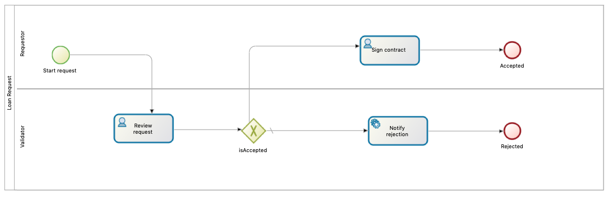

# Bonita Loan Request Application


This application is an example of how to embed Bonita Engine (BPM workflow engine)
is a **Spring Boot** application.  
The propose use-case is an application based on a process that allows someone to request
a Loan from their bank. On its side, the bank can review the request, approve or reject the loan request
and say why.


## Scope
In this tutorial, you will learn how to write an application, using Spring Boot framework, that integrates
Bonita Execution Engine to operate processes.  
You will learn how to configure Bonita Engine to point to the database of your choice and tune the connection pool.


## Prerequisites
### Database

If you just want to run an embedded H2 database, nothing is required.

To have your application point to a MySQL, PostgreSQL, Microsoft SQL Server, or Oracle database make sure
you have a Database server up and running, and that it contains a schema reserved for Bonita Engine (default name is `bonita`).  
For deeper details on database preparation for Bonita, see [the specific documentation page](https://documentation.bonitasoft.com/bonita/current/database-configuration).

### Processes
This tutorial assumes you have basic knowledge of BPMN / process designing.

## Use case
For this example, we will develop and interact with the following process.



## Let's write the application step by step

In this example, we propose to use **Gradle** as the build tool, and **Kotlin** as the programming language.  
If you are not familiar with Gradle, there is a Maven version of this example. [AVAILABLE SOON]  
If you are not familiar with Kotlin, don't worry, it can be read easily if you know Java or a similar language.
There is also a Java version of this example. [AVAILABLE SOON]  


### Boostrap of the application, using Spring boot
Let's write a Gradle build (file `build.gradle.kts`) with the minimum Spring boot + Kotlin requirements:
```kotlin
import org.jetbrains.kotlin.gradle.tasks.KotlinCompile

plugins {
    id("org.springframework.boot") version "2.1.6.RELEASE"
    id("io.spring.dependency-management") version "1.0.7.RELEASE"
    kotlin("jvm") version "1.3.41"
    kotlin("plugin.spring") version "1.3.41"
}

repositories {
    mavenCentral()
    jcenter()
}

dependencies {
    // Embed an application server:
    implementation("org.springframework.boot:spring-boot-starter")
    
    // Libs to code in Kotlin:
    implementation("org.jetbrains.kotlin:kotlin-reflect")
    implementation("org.jetbrains.kotlin:kotlin-stdlib-jdk8")
}

java.sourceCompatibility = JavaVersion.VERSION_1_8

// configure Kotlin compiler:
tasks.withType<KotlinCompile> {
    kotlinOptions {
        freeCompilerArgs = listOf("-Xjsr305=strict")
        jvmTarget = "1.8"
    }
}
```

Write the main Spring boot class to launch our application:
```kotlin
package org.bonitasoft.loanrequest

import org.springframework.boot.autoconfigure.SpringBootApplication
import org.springframework.boot.runApplication

@SpringBootApplication
class LoanRequestApplication

fun main(args: Array<String>) {
    runApplication<LoanRequestApplication>(*args)
}
```
In the current state, our application can already be run (but does not do anything) by typing in the command line:
```
./gradlew bootRun
```
and can then be accessed at http://localhost:8080/


### Adding Bonita Engine

Now, let's add Bonita Engine in the equation in our `build.gradle.kts`:
```kotlin
...
dependencies {
    ...
    val bonitaEngineVersion = "7.9.0"

    // adding dependency on bonita-engine-spring-boot-starter automatically provides
    // and starts a Bonita Engine when used in a Spring Boot application:
    implementation("org.bonitasoft.engine:bonita-engine-spring-boot-starter:$bonitaEngineVersion")

    // use bonita-client to be able to interact with the running Engine
    // to deploy and run instances of processes:
    implementation("org.bonitasoft.engine:bonita-client:$bonitaEngineVersion")
    
    // Add the database driver we want Bonita to use:
    runtime("com.h2database:h2:1.4.199")
    ...
}
```
Now, through the magic of Spring boot, a Bonita Engine is automatically started when our application starts.  
We can see Engine startup logs in the console:
```
|09:44:15.601|main|INFO |o.b.p.s.ScriptExecutor| configuration for Database vendor: h2
|09:44:15.989|main|INFO |o.b.p.s.PlatformSetup| Connected to 'h2' database with url: 'jdbc:h2:file:./build/h2_database/bonita' with user: 'BONITA'
|09:44:16.341|main|INFO |o.b.p.s.ScriptExecutor| Executed SQL script file:/home/manu/.gradle/caches/modules-2/files-2.1/org.bonitasoft.platform/platform-resources/7.9.0/c183cb/platform-resources-7.9.0.jar!/sql/h2/createTables.sql
...
|09:44:26.437|main|INFO |o.b.e.a.i.PlatformAPIImpl| THREAD_ID=1 | HOSTNAME=manu-laptop | Start service of platform : org.bonitasoft.engine.classloader.ClassLoaderServiceImpl
|09:44:26.438|main|INFO |o.b.e.a.i.PlatformAPIImpl| THREAD_ID=1 | HOSTNAME=manu-laptop | Start service of platform : org.bonitasoft.engine.cache.ehcache.PlatformEhCacheCacheService
|09:44:26.490|main|INFO |o.b.e.a.i.PlatformAPIImpl| THREAD_ID=1 | HOSTNAME=manu-laptop | Start service of platform : org.bonitasoft.engine.service.BonitaTaskExecutor
...
|09:44:26.708|main|INFO |o.b.e.a.i.t.SetServiceState| THREAD_ID=1 | HOSTNAME=manu-laptop | TENANT_ID=1 | start tenant-level service org.bonitasoft.engine.cache.ehcache.EhCacheCacheService on tenant with ID 1
|09:44:26.718|main|INFO |o.b.e.a.i.t.SetServiceState| THREAD_ID=1 | HOSTNAME=manu-laptop | TENANT_ID=1 | start tenant-level service org.bonitasoft.engine.business.data.impl.JPABusinessDataRepositoryImpl on tenant with ID 1
```

### Let's code our first process

Create a LoanRequestProcessBuilder class that builds a Bonita process and returns a DesignProcessDefinition.

```kotlin
package org.bonitasoft.loanrequest.process

// imports removed for lisibility

const val ACTOR_REQUESTER = "Requester"
const val ACTOR_VALIDATOR = "Validator"

const val START_EVENT = "Start Request"
const val REVIEW_REQUEST_TASK = "Review Request"
const val DECISION_GATEWAY = "isAccepted"
const val SIGN_CONTRACT_TASK = "Sign contract"
const val NOTIFY_REJECTION_TASK = "Notify rejection"
const val ACCEPTED_END_EVENT = "Accepted"
const val REJECTED_END_EVENT = "Rejected"

const val CONTRACT_AMOUNT = "amount"

class LoanRequestProcessBuilder {

    fun buildExampleProcess(): DesignProcessDefinition {
        val processBuilder = ProcessDefinitionBuilder().createNewInstance("LoanRequest", "1.0")
        // Define the actors of the process:
        processBuilder.addActor(ACTOR_REQUESTER, true) // only requester can initiate a new process
        processBuilder.addActor(ACTOR_VALIDATOR) // only requester can initiate a new process
        // Define the tasks
        processBuilder.addUserTask(REVIEW_REQUEST_TASK, ACTOR_VALIDATOR)
        processBuilder.addUserTask(SIGN_CONTRACT_TASK, ACTOR_REQUESTER) // Imagine this task involve paper signing

        // For completion, this auto-task should have a connector on it,
        // to notify the rejection (through email connector, for example):
        processBuilder.addAutomaticTask(NOTIFY_REJECTION_TASK)

        // Define the events:
        processBuilder.addStartEvent(START_EVENT)
        processBuilder.addEndEvent(ACCEPTED_END_EVENT)
        processBuilder.addEndEvent(REJECTED_END_EVENT)
        // Define the Gateway:
        processBuilder.addGateway(DECISION_GATEWAY, GatewayType.EXCLUSIVE)
        // Define transitions:
        processBuilder.addTransition(START_EVENT, REVIEW_REQUEST_TASK)
        processBuilder.addTransition(REVIEW_REQUEST_TASK, DECISION_GATEWAY)
        processBuilder.addTransition(DECISION_GATEWAY, SIGN_CONTRACT_TASK,
                // let's simulate a human decision with a random accepted / rejected decision:
                ExpressionBuilder().createGroovyScriptExpression("random decision", "new java.util.Random(System.currentTimeMillis()).nextBoolean()", "java.lang.Boolean")
        )
        processBuilder.addDefaultTransition(DECISION_GATEWAY, NOTIFY_REJECTION_TASK) // Default transition, taken is expression above returns false
        processBuilder.addTransition(SIGN_CONTRACT_TASK, ACCEPTED_END_EVENT)
        processBuilder.addTransition(NOTIFY_REJECTION_TASK, REJECTED_END_EVENT)

        // Define a contract on the process initiation:
        processBuilder.addContract().addInput(CONTRACT_AMOUNT, Type.DECIMAL, "Amount of the loan requested")
        // Here we imagine a more complex contract with more inputs...

        return processBuilder.process
    }

}
```

Then this process must be deployed and enabled. Let's create a dedicated class for that:
```kotlin
package org.bonitasoft.loanrequest.process

// imports...

class ProcessDeployer {

    @Throws(BonitaException::class)
    fun deployAndEnableProcessWithActor(designProcessDefinition: DesignProcessDefinition,
                                        requesterActor: String,
                                        requesterUser: User,
                                        validatorActor: String,
                                        validatorUser: User): ProcessDefinition {
        // Create the Actor Mapping with our Users:
        val requester = Actor(requesterActor)
        requester.addUser(requesterUser.userName)
        val validator = Actor(validatorActor)
        validator.addUser(validatorUser.userName)
        val actorMapping = ActorMapping()
        actorMapping.addActor(requester)
        actorMapping.addActor(validator)
        
        // Create the Business Archive to deploy:
        val businessArchive = BusinessArchiveBuilder().createNewBusinessArchive()
                .setProcessDefinition(designProcessDefinition)
                // set the actor mapping so that the process is resolved and can then be enabled:
                .setActorMapping(actorMapping)
                .done()

        with(apiClient.processAPI) {
            val processDefinition = deploy(businessArchive)
            enableProcess(processDefinition.id)
            return processDefinition
        }
    }
}
```

Let's now call our build and deploy methods from our main application:

```kotlin
val apiClient = APIClient()

// Log in on Engine API:
loginAsTenantAdministrator()
// Create business users to interact with the process:
val requester = createNewUser("requester", "bpm", "Requester", "LoanRequester")
val validator = createNewUser("validator", "bpm", "Validator", "LoanValidator")
// Use this newly created users to create and execute the process flow:
loginWithAnotherUser(requester)
val processDefinition = createAndDeployProcess(requester, validator)


private fun loginAsTenantAdministrator() {
    apiClient.logout()
    apiClient.login(TENANT_ADMIN_NAME, TENANT_ADMIN_PASSWORD)
}

private fun createNewUser(userName: String, password: String, firstName: String, lastName: String): User {
    return apiClient.identityAPI.createUser(userName, password, firstName, lastName)
}

private fun loginWithAnotherUser(newUser: User) {
    apiClient.logout()
    apiClient.login(newUser.userName, "bpm")
}

private fun createAndDeployProcess(initiator: User, validator: User): ProcessDefinition {
    // Create the process:
    val designProcessDefinition = LoanRequestProcessBuilder().buildExampleProcess()
    // Deploy the process and enable it:
    return ProcessDeployer().deployAndEnableProcessWithActor(
            designProcessDefinition, ACTOR_REQUESTER, initiator, ACTOR_VALIDATOR, validator)
}
```

At this point, our process is created and deployed in Bonita.  
Let's check that by writing a HTTP endpoint that lists all existing processes.  
For that, we need to add a simple spring-boot dependency and its json library, to return the results in Json format:
In file `build.gradle.kts`, in the `dependencies { }` section
```kotlin
    // Libs to expose Rest API through an embedded application server:
    implementation("org.springframework.boot:spring-boot-starter-web:2.1.6.RELEASE")
    implementation("com.fasterxml.jackson.module:jackson-module-kotlin:2.9.8")
```
Now we can write a simple [Spring MVC controller](https://docs.spring.io/spring/docs/current/spring-framework-reference/web.html) to expose our processes through an HTTP API:
```kotlin
package org.bonitasoft.loanrequest.api

import org.bonitasoft.engine.api.APIClient
import org.bonitasoft.engine.bpm.process.ProcessDeploymentInfo
import org.bonitasoft.engine.search.SearchOptionsBuilder
import org.bonitasoft.loanrequest.process.CONTRACT_AMOUNT
import org.springframework.web.bind.annotation.GetMapping
import org.springframework.web.bind.annotation.PathVariable
import org.springframework.web.bind.annotation.RestController

@RestController
// our apiClient is automagically :-) injected by Spring:
class ProcessController(val apiClient: APIClient) {

    // Expose the deployed processes through Rest Apis:
    @GetMapping("/processes")
    fun list(): List<ProcessDeploymentInfo> {
        apiClient.login("install", "install")
        val result = apiClient.processAPI.searchProcessDeploymentInfos(SearchOptionsBuilder(0, 100).done()).result
        apiClient.logout()
        return result
    }
}
```
Now restart our application with `./gradlew bootRun`.  
Our application starts and creates and deploys our process.  
Let's access http://localhost:8080/processes to list our processes. The result should be like:
```json
[
    {
        "id": 1,
        "name": "LoanRequest",
        "version": "1.0",
        "displayDescription": null,
        "deploymentDate": "2019-07-05T09:33:21.490+0000",
        "deployedBy": 1,
        "configurationState": "RESOLVED",
        "activationState": "ENABLED",
        "processId": 7450221031288910000,
        "displayName": "LoanRequest",
        "lastUpdateDate": "2019-07-05T09:33:21.607+0000",
        "iconPath": null,
        "description": null
    }
]
```
Beware that the field "processId" is incorrect, due to a limitation of the Json / Javascript `Long` size, which is
smaller that the `Long` size in Java (or Kotlin). The symptom is that the last digits are 0000 instead of real value. 


### Deploy a Process designed with Bonita Studio
If you have designed your process using Bonita Studio (graphical tool), you can deploy the generated `.bar` file through
the APIs as well. To do so, place your .bar file somewhere in the classpath of the application and load it that way:

```kotlin
fun loadProcessFromBar(barFilePath: String): BusinessArchive {
    this.javaClass.getResourceAsStream(barFilePath).use { resourceAsStream ->
        return BusinessArchiveFactory.readBusinessArchive(resourceAsStream)
    }
}
```
and the call to the "load" function and then deploy:
```kotlin
val processFromBar = ProcessLoader().loadProcessFromBar("/SimpleProcess--1.0.bar")
ProcessDeployer().deployAndEnableBusinessArchiveWithoutAnyActor(processFromBar)
```

We can see that our process named `SimpleProcess` is now deployed:
```bash
|15:50:59.107|main|INFO |o.b.e.b.BusinessArchiveServiceImpl| THREAD_ID=1 | HOSTNAME=Ubuntu | TENANT_ID=1 | The user <requester> has installed process <SimpleProcess> in version <1.0> with id <6733385816066783268>
|15:50:59.119|BonitaTaskExecutor|INFO |o.b.e.c.ClassLoaderServiceImpl| THREAD_ID=60 | HOSTNAME=Ubuntu | Refreshing classloader with key: PROCESS:6733385816066783268
|15:50:59.200|main|INFO |o.b.e.a.i.t.p.EnableProcess| THREAD_ID=1 | HOSTNAME=Ubuntu | TENANT_ID=1 | The user <requester> has enabled process <SimpleProcess> in version <1.0> with id <6733385816066783268>
```

Full example can be found in the [source code](./src/main/kotlin/org/bonitasoft/loanrequest/LoanRequestApplication.kt).

**Warning**: be aware that a .bar file generated by a certain Studio version is compatible with the same version of Bonita
you imported in your Gradle dependencies. If you update the dependency to a newer version, you may need to regenerate the .bar file with
the same newer version of Bonita Studio.


### Interact with the process

Now we need to execute the process, as a human would do, so that the flow goes forward.  
The interactions depend on the design of our process.  
Let's complete our main application flow:
```kotlin
...
executeProcess(requester, validator, processDefinition)

@Throws(BonitaException::class)
fun executeProcess(initiator: User, validator: User, processDefinition: ProcessDefinition) {
    // Start a new Loan request with an amount of 12000.0 (€ Euro):
    val processInstance = apiClient.processAPI.startProcessWithInputs(processDefinition.id, mapOf(Pair(CONTRACT_AMOUNT, 12000.0)))

    // Now the validator needs to review it:
    loginWithAnotherUser(validator)
    // Wait for the user task "Review Request" to be ready to execute, using a user member of "Validator" actor:
    val reviewRequestTask = waitForUserTask(validator, processInstance.id, REVIEW_REQUEST_TASK)

    // Take the task and execute it:
    apiClient.processAPI.assignAndExecuteUserTask(validator.id, reviewRequestTask.id, emptyMap())

    // If the request has been accepted, wait for the "Sign contract" task to be ready and execute it:
    val signContractTask = waitForUserTask(initiator, processInstance.id, SIGN_CONTRACT_TASK)
    apiClient.processAPI.assignAndExecuteUserTask(initiator.id, signContractTask.id, emptyMap())

    // Wait for the whole process instance to finish executing:
    waitForProcessToFinish()

    println("Instance of Process LoanRequest(1.0) with id ${processInstance.id} has finished executing.")
}

fun waitForUserTask(user: User, processInstanceId: Long, userTaskName: String): HumanTaskInstance {
    Awaitility.await("User task should not last so long to be ready :-(")
            .atMost(TEN_SECONDS)
            .pollInterval(FIVE_HUNDRED_MILLISECONDS)
            .until(Callable<Boolean> {
                apiClient.processAPI.getNumberOfPendingHumanTaskInstances(user.id) == 1L
            })
    return apiClient.processAPI.getHumanTaskInstances(processInstanceId, userTaskName, 0, 1)[0]
}

fun waitForProcessToFinish() {
    Awaitility.await("Process instance lasts long to complete")
            .atMost(TEN_SECONDS)
            .pollInterval(FIVE_HUNDRED_MILLISECONDS)
            .until(Callable<Boolean> {
                apiClient.processAPI.numberOfArchivedProcessInstances == 1L
            })
}

```

### Writing tests on top of our application

Let's write some integration tests for our application:
```kotlin
package org.bonitasoft.loanrequest

import org.junit.Test
import org.junit.runner.RunWith
import org.springframework.boot.test.context.SpringBootTest
import org.springframework.test.context.junit4.SpringRunner

@RunWith(SpringRunner::class)
@SpringBootTest
class LoanRequestApplicationTests {

    @Test
    fun `process should be started and can be operated with human tasks`() {
        // TODO complete this with business logics...
    }

}
```


### Bonus: cherry on the cake
Spring boot allows to easily tune the banner that is displayed when an application starts.  
Simply put a `banner.txt` file in the `resources` folder with some ASCII art:
```kotlin
 _                        ______                           _
| |                       | ___ \                         | |
| |     ___   __ _ _ __   | |_/ /___  __ _ _   _  ___  ___| |_
| |    / _ \ / _` | '_ \  |    // _ \/ _` | | | |/ _ \/ __| __|
| |___| (_) | (_| | | | | | |\ \  __/ (_| | |_| |  __/\__ \ |_
\_____/\___/ \__,_|_| |_| \_| \_\___|\__, |\__,_|\___||___/\__|
                                        | |
                                        |_|
```

### Expose Business monitoring on our application flow
Maybe we want our application to expose APIs to be able to follow the flow of our processes.  
Simply add the following Rest Controller class to expose the **running** and **completed** cases (process instances):
```kotlin
package org.bonitasoft.loanrequest.api

import org.bonitasoft.engine.api.APIClient
// ...
import org.springframework.web.bind.annotation.GetMapping
import org.springframework.web.bind.annotation.RestController

@RestController
class CaseController(val apiClient: APIClient) {

    // Expose the open process instances (=cases not completed)
    @GetMapping("/cases")
    fun list(): List<ProcessInstance> {
        apiClient.login("install", "install")
        try {
            return apiClient.processAPI
                    .searchOpenProcessInstances(SearchOptionsBuilder(0, 100).done())
                    .result
        } finally {
            apiClient.logout()
        }
    }

    // Expose the finished process instances (=cases completed)
    @GetMapping("/completedcases")
    fun listCompleted(): List<ArchivedProcessInstance> {
        apiClient.login("install", "install")
        try {
            return apiClient.processAPI
                    .searchArchivedProcessInstances(SearchOptionsBuilder(0, 100).done())
                    .result
        } finally {
            apiClient.logout()
        }
    }
    
}
```

Similarly, to expose the tasks ready to execute, add the 
```kotlin
package org.bonitasoft.loanrequest.api

// ...
import org.springframework.web.bind.annotation.PathVariable
import org.springframework.web.bind.annotation.RestController

@RestController
class TaskController(val apiClient: APIClient) {

    @GetMapping("/tasks")
    fun list(): List<HumanTaskInstance>? {
        apiClient.login("install", "install")
        val result = apiClient.processAPI.searchMyAvailableHumanTasks(
                apiClient.session.userId,
                SearchOptionsBuilder(0, 100).done())
                .result
        apiClient.logout()
        return result
    }
}
```

## Full example
This repository contains the full code of this example, ready to build / run.

## Build your application
run `./gradlew build` to build the binaries. It will generate a jar file in `build/libs/` folder.


## Run your application
Simply run the gradle command:
```
./gradlew bootRun
```
or run the previously-built jar file:
```bash
java -jar build/libs/bonita-loan-request-application.jar
```
You can then access the list of processes by opening a web browser at http://localhost:8080/processes.  
The list of cases (process instances) is available at http://localhost:8080/cases.  
The list of finished cases (completed process instances) is available at http://localhost:8080/completedcases.  
The list of tasks is available at http://localhost:8080/tasks.  

## Configure the database
When nothing is specified, an embedded H2 database is created and used.  
To use a different database, in folder `resources` create a standard Spring Boot configuration file named `application.properties` (or.yaml)
and set the following properties. Here is an example with PostgreSQL:
```properties
# specify the database vendor you wish to use (supported values are h2, mysql, postgres, sqlserver, oracle):
org.bonitasoft.engine.database.bonita.db-vendor=postgres
# specify the URL to connect to your database:
org.bonitasoft.engine.database.bonita.url=jdbc:postgresql://localhost:5432/bonita

# specify the connection user to the database:
org.bonitasoft.engine.database.bonita.user=bonita
# specify the connection password to the database:
org.bonitasoft.engine.database.bonita.password=bpm
org.bonitasoft.engine.database.bonita.datasource.maxPoolSize=3

# specify a different AppServer port if required:
server.port=8080
```
The provided `application.properties` file contains examples for all Database vendors.

Finally, don't forget to replace the default H2 dependency for your PostgreSQL drivers in file `build.gradle.kts`:
```kotlin
    // runtime("com.h2database:h2:1.4.199")
    // runtime("mysql:mysql-connector-java:8.0.14")
     runtime("org.postgresql:postgresql:42.2.5")
    // runtime("com.microsoft.sqlserver:mssql-jdbc:7.2.1.jre8")
    // Oracle database drivers are not open-source and thus cannot be included here directly
```
